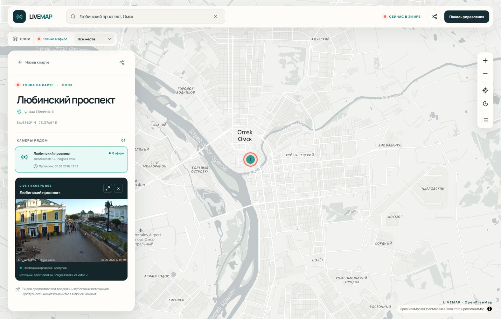

# Проверка всех черновиков · 30 сентября 2026

Проверены все десять черновиков на публичном домене [LiveMap](https://livemap-demo.onrender.com/). Семь камер одобрены и опубликованы штатными запросами админки; действия записаны в `audit_events`. В базе и публичном API после обхода worker: **15 камер online, 14 мест, 8 регионов, 3 черновика**. В начале проверки одна из восьми ранее опубликованных камер была скрыта вместе с местом: точка Гостиного двора возвращена на карту.

## Результаты

| ID | Место / источник | Проверка в браузере LiveMap | Решение |
| --- | --- | --- | --- |
| 1 | Садовая улица, Петербург / YouTube | «Запись этой трансляции недоступна» при встраивании с Referer LiveMap | Черновик, offline; нужен новый официальный эфир |
| 2 | Болотная площадь, Москва | [Оператор](https://bolotnaya.online/ru/cameras/) сообщает об отключении с 02.06.2026; URL отсутствует | Черновик, offline; дождаться восстановления |
| 3 | Кухня Додо Пиццы, Казань / Ivideon | 1920×1080; после Play `readyState=4`, `paused=false`, время 65→79 с; видны работающие сотрудники | Опубликована; категория «Другое» |
| 5 | Площадь Ленина, Новосибирск / RUTUBE | «Просмотр видео запрещен на этом сайте» внутри LiveMap | Черновик, offline; автору нужно разрешить встраивание или предложить другой публичный плеер |
| 6 | Любинский проспект, Омск / VK Video | 852×480; после Play `readyState=4`, `paused=false`, время 34425→34437 с; текущая дата в кадре | Опубликована |
| 7 | Калинина, 84 — вид в сторону Золотого моста, Владивосток / АльянсГлаз | 1280×720; после Play `readyState=4`, `paused=false`, время 78→98 с; текущая дата; ночью сильные блики | Опубликована; название уточнено по плееру оператора |
| 8 | Садовая, 3а, Уссурийск / АльянсГлаз | 1280×720; после Play `readyState=4`, `paused=false`, время 51→66 с; виден уличный перекрёсток | Опубликована |
| 9 | Пирогова, 16, Находка / АльянсГлаз | 1280×720; после Play `readyState=4`, `paused=false`, время 100→114 с; видны улица и парковка | Опубликована |
| 15 | Интернациональная улица, Новый Уренгой / HLS 12 БИТ | 1920×1086; `readyState=4`, `paused=false`, время 1→12 с; текущая дата в кадре | Опубликована; подпись сообщает о примерной точке |
| 16 | Судостроительная улица, Красноярск / HLS Telecoma | 2592×1520; `readyState=4`, `paused=false`, время 8→17 с; текущая дата в кадре | Опубликована; неподтверждённый номер 25Д убран |

Текущие результаты, даты ручного подтверждения и заметки источников сохранены в [машиночитаемом отчёте](../demo/reviews/2026-09-30.json). Это снимок проверки, доступность эфиров может измениться. Повторный обход worker подтвердил `online`; публичный `GET /api/v1/places` для России вернул суммарно 15 камер, а карточки всех семи новых мест — доступные `playback_url`.

У VK за время проверки был один сетевой таймаут (`connection_failed`), следующие два обхода снова дали `online`. Это отражено в истории проверок; worker продолжает показывать фактическую доступность, а не фиксированный статус.

## Что изменено

- В админке сохранённую камеру можно открыть кнопкой «Проверить трансляцию» до одобрения и публикации. Предпросмотр не отправляет PATCH, не публикует камеру и не ставит дату подтверждения автоматически. Несохранённые изменения блокируют предпросмотр, чтобы проверяемый URL соответствовал сохранённым данным.
- CSP и правила публичного каталога поддерживают точные домены `glaz.inetvl.ru`, `vkvideo.ru`, `www.youtube.com`. Для АльянсГлаз и VK допускаются только известные параметры публичных плееров.
- VK использует анонимную цепочку `vkvideo.ru → login.vk.ru → vkvideo.ru → исходный embed`. Worker поддерживает только эти адреса и пути, максимум три перенаправления, с общим таймаутом и проверкой публичного DNS. Конечный URL обязан совпасть с исходной камерой. Остальные проверки по-прежнему отклоняют перенаправления.
- Сохранены исходные атрибуции, ссылки и контакты удаления. Одобрение выполнено по поручению владельца LiveMap для уже публичных эфиров; отдельные индивидуальные разрешения операторов не получены и не заявляются в данных как полученные.
- Геопривязки Нового Уренгоя и Красноярска остаются примерными; это указано в публичном адресе. Маркер Владивостока обозначает район обзора, а название камеры указывает Калинина, 84. Точные координаты установки нужно уточнить отдельно.

## Проверка изменений

- Production-сборка React/TypeScript прошла.
- Локальные тесты правил источников и CSP прошли; браузерный сценарий предпросмотра подтвердил отсутствие сохранения при открытии и закрытии плеера.
- [CI предпросмотра и провайдеров](https://github.com/D1m4ik-creator/LiveMap/actions/runs/36702336963) и [CI исправления VK](https://github.com/D1m4ik-creator/LiveMap/actions/runs/36704264359) завершились успешно, включая PostGIS и браузерные сценарии.
- Render deploy `dep-daueg8bncjis73far3jg` для кода `701cdb8` — `live`; с публичной карты проверены поиск и открытие новой камеры Омска.

Начальный seed продолжает добавлять камеры черновиками. `seed-verified` сохраняет прежний ограниченный набор из восьми iframe и проверку давности браузерного подтверждения; он не публикует семь новых камер автоматически на другом домене. Названия и заметки кандидатов обновлены для повторного импорта без дубликатов после переименований.
